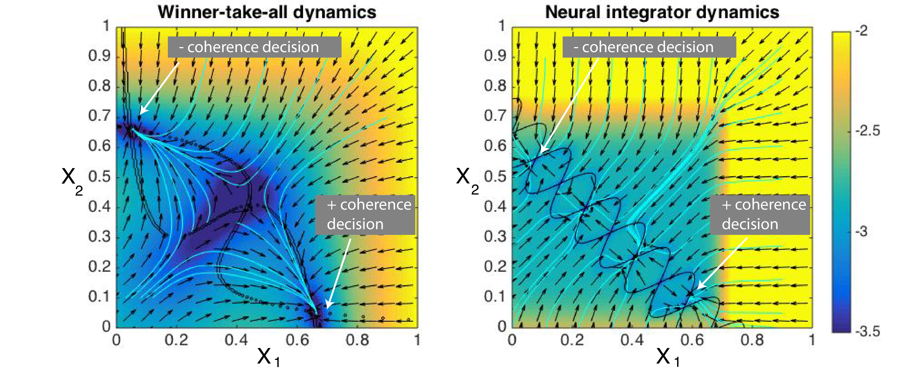
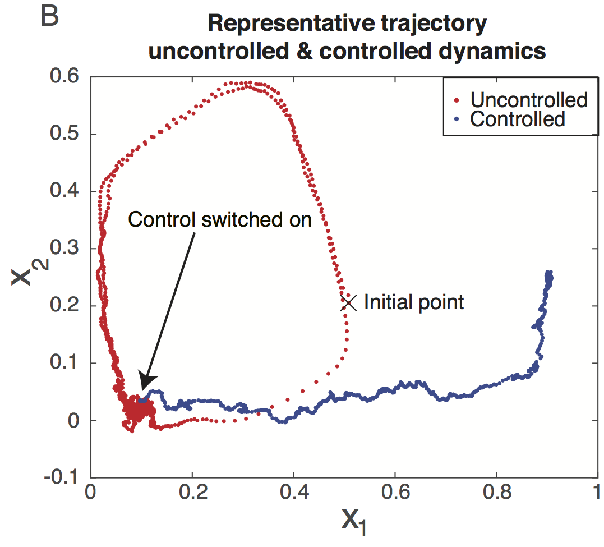
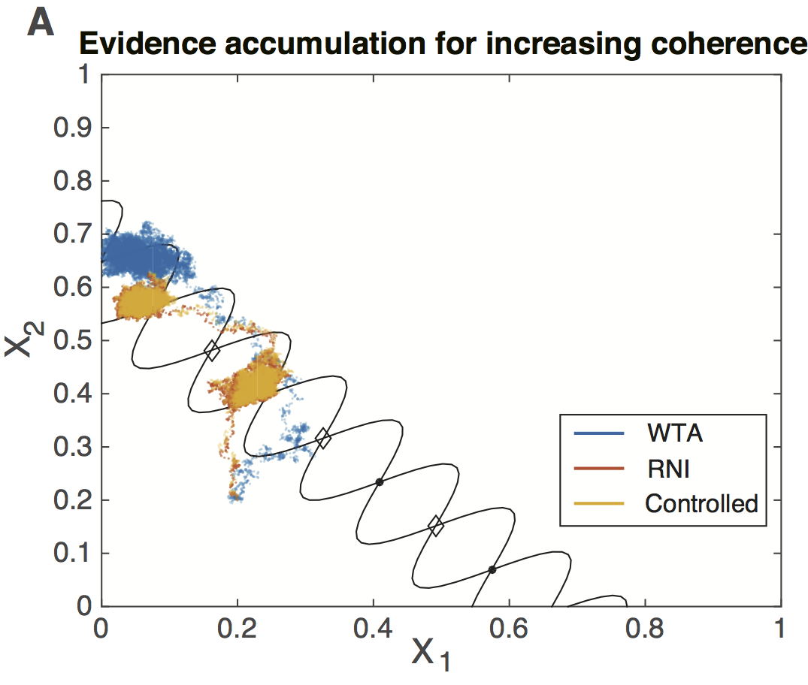

# Neurocontrol, simulations about controlling neural dynamics

# Overview of the research
This is a portion of the work I have been doing to for designing controllers for neural systems. The crux of the research is to use to control to make one dynamical system perform as though it were another dynamical system entirely, without forcing it to perform an exact trajectory through state space. What that means for controlling brain dynamics is that we are devising ways to manipulate the dynamics of the brain to assist it to do what it normally would (but can't for some reason), NOT to wrench it into doing something it otherwise wouldn't do. 

I have been exploring two domains of reserach for this approach. The first is for attempting to assist the diseased brain to restore its healthy function, with example code shown in sim_lag_myopic_wang.ipynb. This is extremely important for disorders like Parkinson's disease (PD), that may have an overall brain "state" that is indicative of some symptom, such as a body tremor. It is our belief that these symptoms are related to an overall state of the brain that is stuck in some unhealthy form. We explore how neural control could be used to let the neural dyanmics operate as though that unhealthy disease state never existed, and perform its healthy action. In our specific example a limit cycle attractor state acts as the tremor state for a patient that is trying to perform a motor action (denoted by one of three stable states). Uncontrolled dynamics fall into the limit cycle attractor and oscillate at around 20Hz, the same as a beta oscillation seen in PD patients. However, controlled dynamics perform as though the limit cycle never existed, and casually make their way over to one of the motor command stable states. We essentially let the brain dynamics do their own thing without "telling" them to go over to those motor command states, which is the crux of our philosophy that we shouldn't use control to specifically direct the dynamics of the brain.

The second domain of research is to use neural stimulation as an investigatory tool to probe the casual dynamics of the brain, with example code shown in sim_threechoice.ipynb. Basically, rather than use it as a therapy for a diseased brain, I want to explore using it as a tool to better understand the brain by testing theories about how we think the brain processes information, makes decisions, etc. The example I looked at for controlling neural dynamics in that context is to try and force one type of decision-making model thought to be performed by monkeys during visual decision making tasks (the Winner-Take-All model), and make it perform as though it were a more robust decision making process known as a robust neural integrator. The idea is the same, to make one dynamical system peform as though it were another. But in this context we demonstrate that it is possible to change the nature of the decision-making process to allow for more careful integration of evidence.

This task is modeled around a visual decision making task in which a subject has to discriminate between dots that are either mostly moving to the left (negative coherence stimulus), or mostly to the right (positive coherence stimulus). In the winner-take-all (WTA) dynamics model, performing this task essentially create a flow in their dynamics that naturally leads to one of two decisions depending upon the stimulus, and leads to one of two stable points. The robust neural integrator, though, has a line of intermediate stable points in between those two decision points that can allow for accumulation of more evidence (i.e., viewing more of the stimulus) before making a decision. There is nothing empirically better or worse about either model of decision making, it's just that they are two different models for how a dynamical system in the brain might solve this decision-making problem. We were able to show that the WTA dynamics can be controlled with an external current to perform as though it were the robust neural integrator, which allows the dynamics to pause at the intermediate stable points to allow for more evidence before making the decision. We hope to use this ability to steer one dynamical system to look like another as a means of testing possible models of how these types of computations are performed in the brain.

# conventions
There are two main simulations in this folder i) the winner-take-all to robust neural integrator decision-making process, and ii) a diseased-to-healthy dynamics control example that removed a beta oscillation state from the dynamics. winner-take-all dynamics will typically be named by “wang” or “koulakov” to refer to the authors of the dynamics used in the examples. diseased-to-healthy dynamics are often referred to as “three choice” to refer to the three stable nodes in the dynamics.

# Code description:
## Python code

- sim_lag_myopic_wang.ipynb: notebook example for the winner-take-all control example
- sim_threechoice.ipynb: notebook example for the diseased to healthy dynamics control example
- sim_threechoice_noEKF_initsamples.ipynb: notebook to generate samples of uncontrolled disease trajectories

- picktomat.py: a pickle to .mat script for the simulations run in this work
- sim_lag_myopic_wang.py: the main tensorflow simulation for the winner-take-all to neural integrator.
- sim_threechoice_diseasestart_initcovar.py: The main tensorflow simulation for the diseased-to-healthy control example
- tf_funs.py: The main module containing the tensorflow functions specific to this project, including the myopic controller and state estimator
- threechoice_dynamics.py: The dynamics functions for the diseased-to-healthy control example
- wang_dynamics.py: The dynamics functions for the winner-take-all to neural integrator.

## Matlab code

- gabor_lobes.m: function to return gabor matrix to add into a gradient field to create a local stable point. includes it jacobian wrt state.

- grad_threechoice.m: full gradient for the diseased neural dynamics with the limit cycle attractor and three stable points. based on the NaK model from Izekievich

- grad_threechoice_healthy.m: full gradient for healthy neural dynamics, which masks the limit cycle attractor

- koulakov_line.m: function to return a gradient for the koulakov line (robust neural integrator) at a specified position in a phase plane, as well as it's Jacobian wrt state

- koulakov_nullcline.m: function to plot the nullclines and fixed points of the koulakov line on a phase plane

- loss_gaussian.m: function to calculate the loss function with sampling, using sampling from a normal distribution.

- wong_Sgrad.m: gradient for the Wong and Wang winner-take-all model. includes the Jacobian wrt state and control

